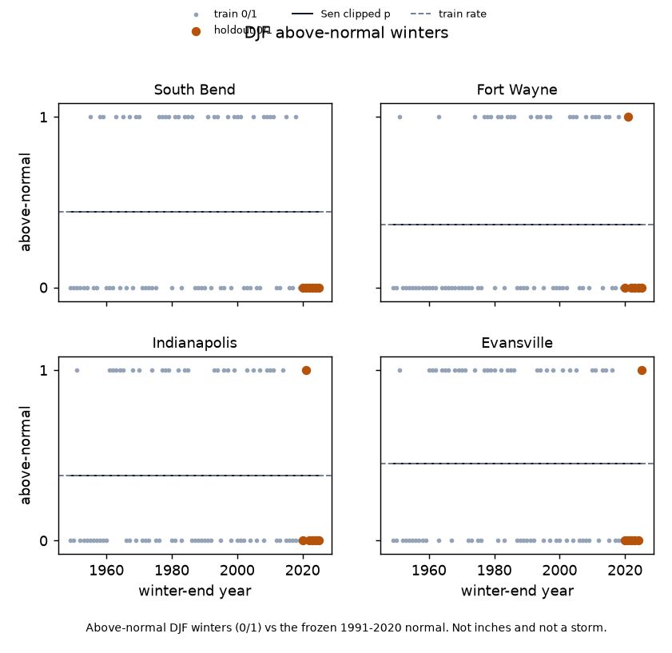
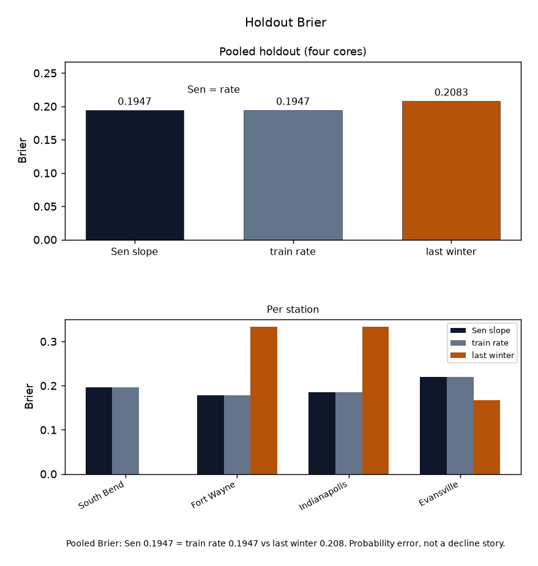

# Indiana DJF above-normal snow frequency vs a flat rate

Does a train-era Sen slope of DJF-above-normal winters beat the train-era above-normal rate at held-out Indiana GHCND cores?

No. Locked `6de7758`. Train-era Sen slope is 0.000 per decade at all four cores. Holdout Brier and MAE are identical to the frozen train-era rate (0.1947 / 0.4352). Last winter's 0/1 is worse on Brier (0.2083) and better on MAE (0.2083). The verdict is Brier vs the rate: Sen does not beat it. Counts of winters the slope gets the sign right are not the method. South Bend holdout 0/6 and the 1/6 rows at Fort Wayne, Indianapolis, and Evansville are small-n rows, not a regional trend. Pages stay off.

Holdout n=24 station-winters on the four cores (DJF 2019-20 through 2024-25). Train: through DJF 2018-19 on the common window starting 1949 (n=70 at South Bend, 71 at the other three). Confirmation DJF 2025-26 is out of train, out of the slope, and out of the rate.

Parents stay frozen: DJF snow `9aa7935`, NWI lake snow `82ce0ce`, first snow date `0ace8a1`. The 1991-2020 DJF normals are the parent lock (South Bend 51.4 in, Fort Wayne 26.2, Indianapolis 21.2, Evansville 9.3).

[DJF snow tercile](https://github.com/martialsystems/indiana_djf_snow_tercile) [DJF inches Sen versus year](https://github.com/martialsystems/indiana_djf_inches_sen) [NWI lake-belt snow](https://github.com/martialsystems/nwi_lake_effect_snow) [First measurable snow date](https://github.com/martialsystems/indiana_first_snow_date) [Precip writeup](https://gist.github.com/martialsystems/b5f900aad37487bb8c0206a321c1ed5c)

Cores: South Bend `USW00014848`, Fort Wayne `USW00014827`, Indianapolis `USW00093819`, Evansville `USW00093817`. Valparaiso `USW00004846`, Michigan City `USC00125604`, LaPorte `USC00124837`, and Indiana Dunes `USC00124244` stay out.



Figure 1. Train and holdout above-normal DJF winters (0/1) versus winter-end year. Holdout zeros are orange marks on y = 0, so South Bend 0/6 is visible. Sen equals the train rate (0.000 / decade): one line, not two. Frozen 1991-2020 normal is the classifier. Above-normal winters, not inches and not a storm.



Figure 2. Holdout Brier. Sen slope vs train-era rate vs last winter. Probability error, not a decline story.

## Live skill (held-out winters)

Locked from `logs/in_live/stage_c_report.json`. Probability. Four cores. The fixture is not the result.

| Predictor of above-normal (0/1) | Brier | MAE |
|---------------------------------|------:|----:|
| Train-era Sen slope (clipped) | 0.1947 | 0.4352 |
| Train-era above-normal rate | 0.1947 | 0.4352 |
| Last winter's 0/1 | 0.2083 | 0.2083 |

Four-core mean train rate: 0.410. Table row, not the method. Train-anchor winter-end year: 1984.0.

### Per station

| Station | Train rate | Sen / decade | Holdout above | Brier slope | Brier rate |
|---------|-----------:|-------------:|--------------:|------------:|-----------:|
| South Bend `USW00014848` | 0.443 | 0.000 | 0/6 | 0.1961 | 0.1961 |
| Fort Wayne `USW00014827` | 0.366 | 0.000 | 1/6 | 0.1787 | 0.1787 |
| Indianapolis `USW00093819` | 0.380 | 0.000 | 1/6 | 0.1845 | 0.1845 |
| Evansville `USW00093817` | 0.451 | 0.000 | 1/6 | 0.2196 | 0.2196 |

OLS linear-probability footnote (not the product): South Bend 0.0033 / year, Fort Wayne 0.0076, Indianapolis 0.0011, Evansville 0.0000.

Confirmation DJF 2025-26 Sen Brier 0.2826 equals the rate. Last winter 0.5000. That row does not reopen a page. Fixture skill does not rescue live.

## Stage 0

Synthetic 0/1 winters at the four cores with a planted slope. Fixture Sen Brier 0.00 vs rate 0.26. That does not rescue live skill.

```bash
python3.12 -m venv .venv
source .venv/bin/activate
pip install -r requirements.txt
PYTHONPATH=src:. python3 scripts/run_fixture.py logs/stage0_fixture
.venv/bin/python -m pytest tests -q
PYTHONPATH=src:. python3 scripts/run_live.py logs/in_live data/raw
```

Empty GHCND SNOW for a required core stops (`run_live.py` exit 2). Two figures max.

| File | Role |
|------|------|
| [METHODOLOGY.md](METHODOLOGY.md) | Locked contract |
| [AGENTS.md](AGENTS.md) | Agent rules |
| [CHECKLIST.md](CHECKLIST.md) | Operator list |
| `src/snowfreq/` | GHCND DJF SNOW, frozen normal, 0/1, Sen, rate, figures |
| `snowfreqforge/` | GraphForge pin |

Precip writeup: https://gist.github.com/martialsystems/b5f900aad37487bb8c0206a321c1ed5c

Research index: https://gist.github.com/martialsystems/66b896b0a4a0b8cba2b478aef64312f3
